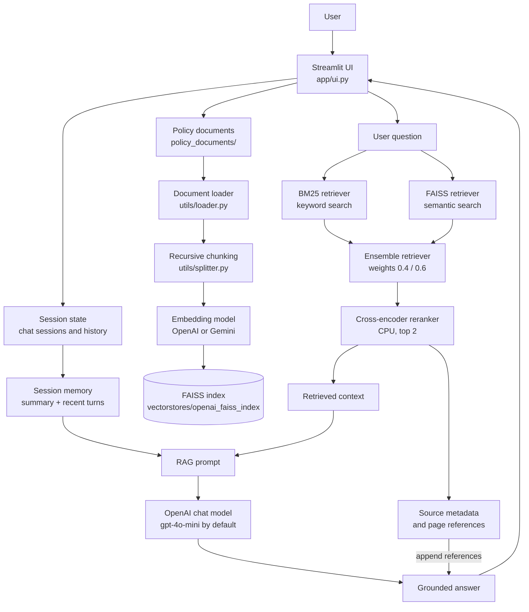

# Enterprise Knowledge Assistant

A Streamlit-based retrieval-augmented generation (RAG) chatbot for asking questions about enterprise policy documents. The assistant combines semantic search, keyword search, cross-encoder reranking, and conversation memory to produce grounded answers with document references.

## Features

- Chat interface built with Streamlit.
- Multiple in-memory chat sessions.
- Clear-chat control for resetting the active session.
- Local FAISS vector store for persistent document embeddings.
- Hybrid retrieval:
  - BM25 keyword retrieval.
  - FAISS similarity retrieval.
  - Weighted ensemble of both retrievers.
  - CPU cross-encoder reranking with `cross-encoder/ms-marco-MiniLM-L-6-v2`.
- Conversation context using:
  - A summarized session memory.
  - A rolling recent Q&A window.
  - LangChain message history.
- PDF, DOCX, TXT, Markdown, and URL loading utilities.
- OpenAI embeddings and chat completion support in the current application path.
- Optional Pinecone vector-store code path in `utils/embedder.py`.
- Policy references appended to answers when the question appears to be policy-related.

## Architecture



## Project Structure

```text
.
├── app/
│   └── ui.py                         # Streamlit application entry point
├── config/
│   ├── config.json                   # RAG, model, vector-store, and chunking settings
│   └── .env                          # Local API keys; do not commit
├── policy_documents/                 # Source policy PDFs and other supported documents
├── utils/
│   ├── embedder.py                   # Embeddings and FAISS/Pinecone persistence
│   ├── hybridSearchAndReRanker.py   # BM25 + vector retrieval + reranking
│   ├── loader.py                     # PDF, DOCX, text, Markdown, and URL loading
│   ├── memory.py                     # Session history and summary memory
│   ├── rag_chain.py                  # Prompt assembly and LLM chain
│   ├── retriever.py                  # Vector-store retriever creation
│   ├── splitter.py                   # Recursive text chunking
│   └── utility.py                    # Environment loading and embedding selection
├── vectorstores/
│   └── openai_faiss_index/           # Existing FAISS index and metadata
├── document_processor_chatbot.ipynb  # Notebook for dependency checks and indexing experiments
├── requirements.txt                  # Python dependencies
└── config.json                       # Legacy model configuration
```

## Requirements

- Windows, macOS, or Linux.
- Python 3.10+ recommended. The included environment was created with Python 3.13.
- An OpenAI API key for the default embedding and chat configuration.
- Enough local disk space for the FAISS index and the reranker model downloaded by Hugging Face on first use.

## Installation

1. Create and activate a virtual environment:

   ```powershell
   python -m venv .venv
   .\.venv\Scripts\Activate.ps1
   ```

   On macOS/Linux:

   ```bash
   python -m venv .venv
   source .venv/bin/activate
   ```

2. Install dependencies:

   ```bash
   pip install -r requirements.txt
   ```

   If the dependency installation does not include the integrations imported by the utility modules, install them explicitly:

   ```bash
   pip install langchain-google-genai langchain-pinecone
   ```

3. Create `config/.env` and add the required secret:

   ```dotenv
   OPENAI_API_KEY=your_openai_api_key
   ```

   `utils/utility.py` loads this file automatically. Keep API keys out of source control.

## Running the Application

The current UI resolves the document directory relative to the `app/` working directory. Start Streamlit from that directory:

```powershell
cd app
streamlit run ui.py
```

Then open the local URL printed by Streamlit, normally `http://localhost:8501`.

On macOS/Linux:

```bash
cd app
streamlit run ui.py
```

On first startup, the app loads the files in `../policy_documents`, splits them into chunks, creates or updates the local FAISS index, initializes hybrid retrieval, downloads the reranker model if needed, and starts the chat interface.

## Using the Chatbot

1. Open the Streamlit URL.
2. Select or create a chat session in the sidebar.
3. Ask a question about the loaded policies, such as leave, benefits, travel, security, conduct, or IT policies.
4. Policy-oriented answers include source filenames and page numbers when that metadata is available.
5. Use **Clear Chat** to reset the active session's UI history and memory.

The current UI exposes an LLM provider selector with `openai` and `gemini`, but the implemented RAG chain currently supports only `openai`. Selecting Gemini will result in an unsupported-provider error until Gemini chat-model support is added to `utils/rag_chain.py`.

## Sample Question and Answer

**Input:**

> What is MDM in VPT?

**Output:**

MDM in Verdant Peak Technologies (VPT) stands for Mobile Device Management. It is a platform that manages and secures employees' devices, including company-issued laptops and personal devices used for work (BYOD - Bring Your Own Device). The MDM system enforces security measures such as disk encryption, automatic security updates, and the capability to remotely wipe data from devices in case of loss or theft. Employees are required to enroll their personal devices in the MDM's BYOD profile, which ensures compliance with security policies, including a minimum passcode requirement and the ability to selectively wipe company data.

**References**

- 04_it_policies.pdf
- 07_code_of_conduct.pdf

## Document Ingestion

Supported inputs in `utils/loader.py`:

- `.pdf`: one LangChain document per PDF page.
- `.docx`, `.doc`, `.docs`: paragraph text joined into one document.
- `.txt`, `.md`: UTF-8 text files.
- `http://` and `https://` URLs: selected headings, paragraphs, and list items from the page.
- Other extensions: attempted as text files.

The Streamlit UI currently processes every file in `policy_documents/` on startup. Each document is split with an application-specific chunk size of `5000` and overlap of `200` before being added to the vector store. The notebook demonstrates a similar indexing flow and can be used for experiments.

## Configuration

The active configuration is `config/config.json`:

| Setting | Current value | Purpose |
| --- | --- | --- |
| `llm_provider` | `openai` | Provider selected for the RAG chat model. |
| `embedding_provider` | `openai` | Provider used to create document/query embeddings. |
| `vector_store.type` | `faiss` | Local vector store used by the app. |
| `vector_store.local.faiss_path` | `vectorstores/faiss_index` | Declared local index path; the current embedder derives `vectorstores/<provider>_<type>_index` unless a path is passed explicitly. |
| `retriever.type` | `base` | Retriever mode in the config file. |
| `retriever.top_k` | `3` | Intended retrieval count. The current retriever implementation uses `k=3`. |
| `prompt.temperature` | `1` | Prompt configuration value retained in the JSON file. |
| `prompt.max_tokens` | `5000` | Prompt configuration value retained in the JSON file. |
| `memory.enables_default` | `true` | Intended default memory setting. The UI currently enables memory directly. |
| `memory.max_memory_window` | `5` | Declared memory window setting. The current memory wrapper defaults to two recent turns. |
| `chunking.chunk_size` | `1000` | Declared chunking setting. The UI currently passes `5000` explicitly. |
| `chunking.chunk_overlap` | `100` | Declared chunk overlap setting. |

The root `config.json` contains a separate legacy model configuration with OpenAI model `gpt-4o-mini`. The current RAG chain also defaults to `gpt-4o-mini` through `utils/rag_chain.py`.

## Vector Store Behavior

For the default FAISS path, `utils/embedder.py` stores the index under:

```text
vectorstores/openai_faiss_index/
├── index.faiss
└── index.pkl
```

If the index exists, the application loads it and adds newly supplied documents. If it does not exist, at least one document must be supplied so the index can be created. FAISS loading uses LangChain's dangerous-deserialization option because the index metadata is stored locally; only load index files from a trusted source.

The embedder also contains a Pinecone branch. To use it, update `vector_store.type` to `pinecone`, configure Pinecone settings, install the required Pinecone integration package, and provide:

```dotenv
PINECONE_API_KEY=your_pinecone_api_key
PINECONE_ENV=your_pinecone_environment
```

## Notebook Workflow

`document_processor_chatbot.ipynb` contains setup and validation cells for:

- Installing LangChain, loader, embedding, FAISS, BM25, and Pinecone-related packages.
- Verifying imports.
- Loading and splitting policy documents.
- Building or updating the vector store.
- Checking BM25 retrieval and embedding providers.

Run the notebook from the project root so paths such as `./policy_documents` and `./config/config.json` resolve correctly.

## Troubleshooting

### `OPEN_API_KEY not found`

Add `OPENAI_API_KEY` to `config/.env`. The error message comes from the current implementation, although the expected environment variable name is `OPENAI_API_KEY`.

### The app cannot find policy documents

Start Streamlit from `app/`:

```powershell
cd app
streamlit run ui.py
```

The current UI uses `../policy_documents` as its source directory.

### FAISS index errors

Confirm that `vectorstores/openai_faiss_index/index.faiss` and `index.pkl` were created with compatible embedding settings. Rebuild the index if the embedding provider or embedding model has changed.

### Slow first request

The first run may download the cross-encoder model and initialize embeddings. Subsequent runs can reuse the local model cache and FAISS index.

### Gemini selection fails

The sidebar currently displays Gemini as an option, but `utils/rag_chain.py` raises an unsupported-provider error for any provider other than OpenAI. Use OpenAI or implement the Gemini chat-model branch before selecting Gemini.

## Security and Data Handling

- API keys are read from `config/.env` and should never be committed.
- Session history, summaries, and recent memory are stored in process memory and are lost when the app stops.
- Uploaded or local policy content is sent to the configured embedding provider and, for answered questions, relevant retrieved context is sent to the configured chat provider.
- Treat FAISS index files and policy documents as trusted local data because FAISS loading permits deserialization.

## License

No license file is currently included in this repository. Add a license before distributing the project publicly.
